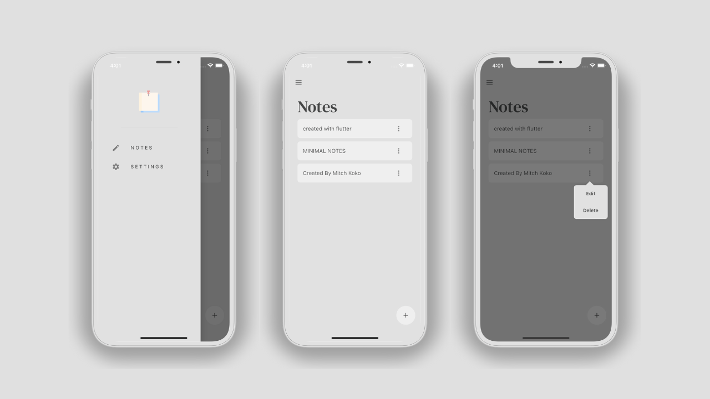
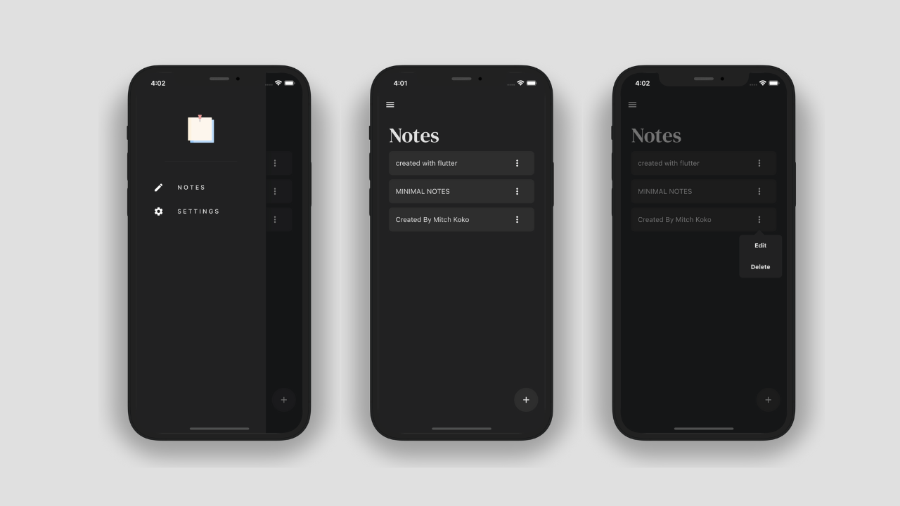

# Notes App

A Functional Notes Flutter Application, Simple & Modern UI, Light & Dark mode available, Create, Read, Update and Delete Notes, Using Provider as State Management.
The notes are saved in the devices local storage using the ISAR Database.

## Images

